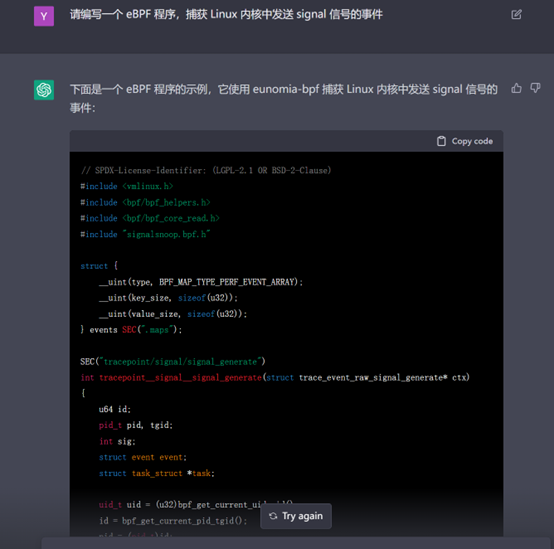

# 基于 libbpf 的 eBPF 开发者教程：通过 20 个小工具一步步学习 eBPF

这是一个基于 `CO-RE`（一次编译，到处运行）的 `libbpf` 的 eBPF 的开发教程，提供了从入门到进阶的 eBPF 开发实践，包括基本概念、代码实例、实际应用等内容。除了通常的教程文本内容，我们也希望通过 ChatGPT 等工具，为您提供交互式的 eBPF 学习体验！

本教程不会进行复杂的概念讲解和场景介绍，主要希望提供一些 eBPF 小工具的案例（**非常短小，从二十行代码开始入门！**），来帮助 eBPF 应用的开发者快速上手 eBPF 的开发方法和技巧。教程内容可以在目录中找到，每个目录都是一个独立的 eBPF 工具案例。

在学习 eBPF 的过程中，我们受到了 [bcc python developer tutorial](https://github.com/iovisor/bcc/blob/master/docs/tutorial_bcc_python_developer.md) 的许多启发和帮助，但从 2022 年的角度出发，使用 libbpf 开发 eBPF 的应用是目前相对更好的选择。但目前似乎很少有基于 libbpf 和 BPF CO-RE 出发的、通过案例和工具介绍 eBPF 开发的教程，因此我们发起了这个项目，采用类似 bcc python developer tutorial 的组织方式，但使用 CO-RE 的 libbpf 进行开发。

本项目主要基于 [libbpf-boostrap](https://github.com/libbpf/libbpf-bootstrap) 和 [eunomia-bpf](https://github.com/eunomia-bpf/eunomia-bpf) 两个框架完成，并使用 eunomia-bpf 帮助简化一部分 libbpf eBPF 用户态代码的编写，让开发者专注于内核态的 eBPF 代码的开发。

教程主要关注于可观测性，并简要介绍了 eBPF 的其他应用，例如网络、安全等等。

Gitee 镜像： <https://gitee.com/yunwei37/bpf-developer-tutorial>

> - 我们还提供了一个使用 ChatGPT ，通过自然语言描述即可自动编写 eBPF 程序和追踪 Linux 系统的小工具，可以让您交互式地学习 eBPF 程序：[GPTtrace](https://github.com/eunomia-bpf/GPTtrace)
> - 欢迎在本仓库的 issue 或 discussion 中提出任意关于 eBPF 学习的疑惑和问题，或者生产实践中遇到的 bug，我们会尽力帮助您解答！

## 目录

- [lesson 0-introduce](src/0-introduce/README.md) 介绍 eBPF 的基本概念和常见的开发工具
- [lesson 1-helloworld](src/1-helloworld/README.md) 使用 eBPF 开发最简单的「Hello World」程序，介绍 eBPF 的基本框架和开发流程
- [lesson 2-kprobe-unlink](src/2-kprobe-unlink/README.md) 在 eBPF 中使用 kprobe 捕获 unlink 系统调用
- [lesson 3-fentry-unlink](src/3-fentry-unlink/README.md) 在 eBPF 中使用 fentry 捕获 unlink 系统调用
- [lesson 4-opensnoop](src/4-opensnoop/README.md) 使用 eBPF 捕获进程打开文件的系统调用集合，使用全局变量在 eBPF 中过滤进程 pid
- [lesson 5-uprobe-bashreadline](src/5-uprobe-bashreadline/README.md) 在 eBPF 中使用 uprobe 捕获 bash 的 readline 函数调用
- [lesson 6-sigsnoop](src/6-sigsnoop/README.md) 捕获进程发送信号的系统调用集合，使用 hash map 保存状态
- [lesson 7-execsnoop](src/7-execsnoop/README.md) 捕获进程执行时间，通过 perf event array 向用户态打印输出
- [lesson 8-execsnoop](src/8-exitsnoop/README.md) 捕获进程退出事件，使用 ring buffer 向用户态打印输出
- [lesson 9-runqlat](src/9-runqlat/README.md) 捕获进程调度延迟，以直方图方式记录
- [lesson 10-hardirqs](src/10-hardirqs/README.md) 使用 hardirqs 或 softirqs 捕获中断事件
- [lesson 11-bootstrap](src/11-bootstrap/README.md) 使用 libbpf-boostrap 为 eBPF 编写原生的 libbpf 用户态代码，并建立完整的 libbpf 工程。
- [lesson 12-profile](src/12-profile/README.md) 使用 eBPF 进行性能分析
- [lesson 13-tcpconnlat](src/13-tcpconnlat/README.md) 记录 TCP 连接延迟，并使用 libbpf-boostrap 或 Webassembly （WASM）在用户态处理数据
- [lesson 14-tcpstates](src/14-tcpstates/README.md) 记录 TCP 连接状态
- [lesson 15-tcprtt](src/15-tcprtt/README.md) 以直方图方式记录 TCP RTT，并使用 libbpf-boostrap 或 WASM 在用户态采样 map 信息
- [lesson 16-memleak](src/16-memleak/README.md) 检测内存泄漏
- [lesson 17-biopattern](src/17-biopattern/README.md) 捕获磁盘 IO 模式
- [lesson 18-further-reading](src/18-further-reading/README.md) 更进一步的相关资料？
- [lesson 19-lsm-connect](src/19-lsm-connect/README.md) 使用 LSM 进行安全检测防御
- [lesson 20-tc](src/20-tc/README.md) 使用 eBPF 进行 tc 流量控制
- [lesson 21-xdp](src/20-xdp/README.md) 使用 eBPF 进行 XDP 报文处理
  
## 为什么需要基于 libbpf 和 BPF CO-RE 的教程？

> 历史上，当需要开发一个BPF应用时可以选择BCC 框架，在实现各种用于Tracepoints的BPF程序时需要将BPF程序加载到内核中。BCC提供了内置的Clang编译器，可以在运行时编译BPF代码，并将其定制为符合特定主机内核的程序。这是在不断变化的内核内部下开发可维护的BPF应用程序的唯一方法。在BPF的可移植性和CO-RE一文中详细介绍了为什么会这样，以及为什么BCC是之前唯一的可行方式，此外还解释了为什么 libbpf 是目前比较好的选择。去年，Libbpf的功能和复杂性得到了重大提升，消除了与BCC之间的很多差异(特别是对Tracepoints应用来说)，并增加了很多BCC不支持的新的且强大的特性(如全局变量和BPF skeletons)。
>
> 诚然，BCC会竭尽全力简化BPF开发人员的工作，但有时在获取便利性的同时也增加了问题定位和修复的困难度。用户必须记住其命名规范以及自动生成的用于Tracepoints的结构体，且必须依赖这些代码的重写来读取内核数据和获取kprobe参数。当使用BPF map时，需要编写一个半面向对象的C代码，这与内核中发生的情况并不完全匹配。除此之外，BCC使得用户在用户空间编写了大量样板代码，且需要手动配置最琐碎的部分。
>
> 如上所述，BCC依赖运行时编译，且本身嵌入了庞大的LLVM/Clang库，由于这些原因，BCC与理想的使用有一定差距：
>
> - 编译时的高资源利用率(内存和CPU)，在繁忙的服务器上时有可能干扰主流程。
> - 依赖内核头文件包，不得不在每台目标主机上进行安装。即使这样，如果需要某些没有通过公共头文件暴露的内核内容时，需要将类型定义拷贝黏贴到BPF代码中，通过这种方式达成目的。
> - 即使是很小的编译时错误也只能在运行时被检测到，之后不得不重新编译并重启用户层的应用；这大大影响了开发的迭代时间(并增加了挫败感...)
>
> Libbpf + BPF CO-RE (Compile Once – Run Everywhere) 选择了一个不同的方式，其思想在于将BPF程序视为一个普通的用户空间的程序：仅需要将其编译成一些小的二进制，然后不用经过修改就可以部署到目的主机上。libbpf扮演了BPF程序的加载器，负责配置工作(重定位，加载和校验BPF程序，创建BPF maps，附加到BPF钩子上等)，开发者仅需要关注BPF程序的正确性和性能即可。这种方式使得开销降到了最低，消除了大量依赖，提升了整体开发者的开发体验。
>
> 在API和代码约定方面，libbpf坚持"最少意外"的哲学，即大部分内容都需要明确地阐述：不会隐含任何头文件，也不会重写代码。仅使用简单的C代码和适当的辅助宏即可消除大部分单调的环节。 此外，用户编写的是需要执行的内容，BPF应用程序的结构是一对一的，最终由内核验证并执行。
>
> 参考：[BCC 到libbpf 的转换指南【译】 - 深入浅出eBPF: https://www.ebpf.top/post/bcc-to-libbpf-guid/](https://www.ebpf.top/post/bcc-to-libbpf-guid/)

## eunomia-bpf

[eunomia-bpf](https://github.com/eunomia-bpf/eunomia-bpf) 是一个开源的 eBPF 动态加载运行时和开发工具链，是为了简化 eBPF 程序的开发、构建、分发、运行而设计的，基于 libbpf 的 CO-RE 轻量级开发框架。

使用 eunomia-bpf ，可以：

- 在编写 eBPF 程序或工具时只编写 libbpf 内核态代码，自动获取内核态导出信息；
- 使用 Wasm 进行 eBPF 用户态程序的开发，在 WASM 虚拟机内部控制整个 eBPF 程序的加载和执行，以及处理相关数据；
- eunomia-bpf 可以将预编译的 eBPF 程序打包为通用的 JSON 或 WASM 模块，跨架构和内核版本进行分发，无需重新编译即可动态加载运行。

eunomia-bpf 由一个编译工具链和一个运行时库组成, 对比传统的 BCC、原生 libbpf 等框架，大幅简化了 eBPF 程序的开发流程，在大多数时候只需编写内核态代码，即可轻松构建、打包、发布完整的 eBPF 应用，同时内核态 eBPF 代码保证和主流的 libbpf, libbpfgo, libbpf-rs 等开发框架的 100% 兼容性。需要编写用户态代码的时候，也可以借助 Webassembly 实现通过多种语言进行用户态开发。和 bpftrace 等脚本工具相比, eunomia-bpf 保留了类似的便捷性, 同时不仅局限于 trace 方面, 可以用于更多的场景, 如网络、安全等等。

> - eunomia-bpf 项目 Github 地址: <https://github.com/eunomia-bpf/eunomia-bpf>
> - gitee 镜像: <https://gitee.com/anolis/eunomia>

## 让 chatGPT 来帮助我们

本教程借助 chatGPT 来学习编写 eBPF 程序，同时我们尝试教会 chatGPT 编写 eBPF 程序，大概步骤如下：

1. 告诉它基本的 eBPF 编程相关的常识
2. 告诉它一些案例：hello world，eBPF 程序的基本结构，如何使用 eBPF 程序进行追踪，并且让它开始编写教程
3. 手动调整教程，并纠正代码和文档中的错误
4. 把修改后的代码再喂给 chatGPT，让它继续学习
5. 尝试让 chatGPT 自动生成 eBPF 程序和对应的教程文档！例如

完整的对话记录可以在这里找到: [chatGPT.md](chatGPT.md)

我们也构建了一个命令行工具的 demo ，通过本教程的训练， 让它通过自然语言描述即可自动编写 eBPF 程序，追踪 Linux 系统：https://github.com/eunomia-bpf/GPTtrace

